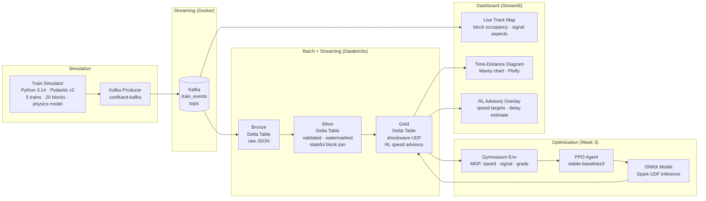

# Real-Time Rail Signal & Scheduling Optimizer

> Multi-agent traffic-flow optimization on streaming infrastructure — Kafka → Spark Structured Streaming → Delta Lake — with a Deep Reinforcement Learning speed-advisory policy and shockwave propagation modeling on a directed graph network.

**Domain:** Railroad Operations Research &nbsp;|&nbsp; **Corridor:** Harrisburg Subdivision (20 blocks, 5 trains, 79 mph MAS)

---

## Architecture



---

## Tech Stack

| Layer | Technology |
|---|---|
| Simulation | Python 3.14 · Pydantic v2 · physics-based speed model |
| Streaming | Apache Kafka · Zookeeper · Docker Compose |
| Processing | Spark Structured Streaming · Databricks Community Edition |
| Storage | Delta Lake — Bronze / Silver / Gold medallion architecture |
| Optimization | OpenAI Gymnasium · PPO (stable-baselines3) · ONNX export |
| Inference | ONNX Runtime wrapped as Spark UDF |
| Dashboard | Streamlit · Plotly (Marey time-distance diagram) |
| Schema | Pydantic v2 `TrainEvent` — Kafka → Spark → Delta contract |

---

## Domain Model

The simulator replicates **absolute block signaling** on the Harrisburg Subdivision:

| Concept | Implementation |
|---|---|
| Block occupancy | One train per block; 20 fixed sections |
| Signal aspects | 3-aspect: clear (green) · approach (yellow) · stop (red) |
| Headway enforcement | Signal computed from 2-block lookahead per train |
| Shockwave propagation | Upstream delay cascade modeled as Spark UDF on Silver table |
| MDP state | `(speed, signal_ahead, blocks_occupied_ahead, schedule_adherence, grade)` |
| MDP action | Discrete speed advisory target |
| Reward | Minimize schedule delay + energy cost (braking penalty) |

---

## Project Status

| Week | Focus | Status |
|---|---|---|
| Week 1 (May 7–13) | Skeleton · Simulator · Kafka · Streamlit live feed | ✅ Complete |
| Week 2 (May 14–19) | Spark Bronze → Silver → Gold pipeline | ✅ Complete |
| Week 3 (May 20–26) | Gymnasium env · PPO training · ONNX → Spark UDF | 🔄 In progress |
| Week 4 (May 27–Jun 3) | Dashboard rebuild from Gold · Marey diagram · deploy | ⬜ Planned |

---

## Quick Start

**Prerequisites:** Docker Desktop, Python 3.14, `pip install -r requirements.txt`

```bash
# 1 — Start Kafka
docker compose up -d

# 2 — Start the train simulator → Kafka producer
python -m simulator.kafka_producer

# 3 — Launch the live dashboard
streamlit run web/app.py
```

Navigate to `http://localhost:8501` to see the live block-occupancy map and train advisory feed updating every ~2 seconds from real Kafka messages.

---

## Resume Bullets

- Built end-to-end streaming ML pipeline: Python simulator → Kafka → Spark Structured Streaming → Delta Lake medallion (Bronze/Silver/Gold), processing 5-train corridor events in real time
- Modeled shockwave propagation on a directed block graph; exposed delay cascade logic as a Spark UDF on the Silver → Gold transform
- Trained PPO agent (stable-baselines3) in a custom Gymnasium environment with MDP state space encoding speed, signal aspect, schedule adherence, and track grade; serialized to ONNX for Spark UDF inference
- Deployed live operations dashboard in Streamlit reading directly from Kafka consumer; Plotly Marey (time-distance) diagram for schedule visualization

---

## Repository Layout

```
simulator/      Pydantic schema · physics sim · Kafka producer
pipelines/      Spark Bronze → Silver → Gold (Databricks notebooks)
models/         Gymnasium env · PPO training · ONNX export
web/            Streamlit dashboard · Plotly components
results/        Experiment log · evaluation figures
```
