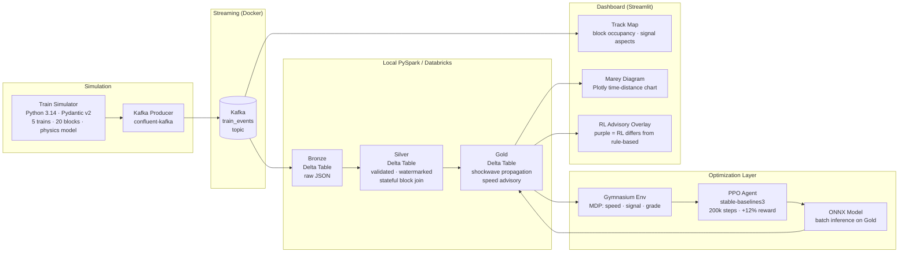

# Real-Time Rail Signal & Scheduling Optimizer

> Multi-agent traffic-flow optimization on streaming infrastructure — Kafka → Spark Structured Streaming → Delta Lake — with a Deep Reinforcement Learning speed-advisory policy and shockwave propagation modeling on a directed graph network.

**Domain:** Railroad Operations Research &nbsp;|&nbsp; **Corridor:** Harrisburg Subdivision (20 blocks, 5 trains, 79 mph MAS)

---

## Architecture



---

## Tech Stack

| Layer | Technology |
|---|---|
| Simulation | Python 3.14 · Pydantic v2 · physics-based speed model |
| Streaming | Apache Kafka · Zookeeper · Docker Compose |
| Processing | Spark Structured Streaming · local PySpark 3.5.3 · Delta Lake 3.2.0 |
| Storage | Delta Lake — Bronze / Silver / Gold medallion architecture |
| Optimization | OpenAI Gymnasium · PPO (stable-baselines3) · ONNX export + onnxruntime |
| Dashboard | Streamlit · Plotly Marey time-distance diagram |
| Schema | Pydantic v2 `TrainEvent` — Kafka → Spark → Delta contract |

---

## Domain Model

The simulator replicates **absolute block signaling** on the Harrisburg Subdivision:

| Concept | Implementation |
|---|---|
| Block occupancy | One train per block; 20 fixed sections |
| Signal aspects | 3-aspect: clear (green) · approach (yellow) · stop (red) |
| Headway enforcement | Signal computed from 2-block lookahead per train |
| Shockwave propagation | Upstream delay cascade modeled as native Spark SQL on Silver → Gold |
| MDP state | 8-dim normalized vector: speed · signal one-hot · blocks ahead · adherence · grade · progress |
| MDP action | Discrete(5) speed advisory targets: 0 / 20 / 40 / 60 / 79 mph |
| Reward | `-|adherence|/300 − 0.3·braking/79 + 0.1·speed/79` (on clear signal) |
| PPO result | +12% mean reward, +65s final schedule adherence vs rule-based baseline |

---

## Project Status

| Week | Focus | Status |
|---|---|---|
| Week 1 (May 7–13) | Skeleton · Simulator · Kafka · Streamlit live feed | ✅ Complete |
| Week 2 (May 14–19) | Spark Bronze → Silver → Gold pipeline | ✅ Complete |
| Week 3 (May 20–26) | Gymnasium env · PPO training · ONNX export · evaluation | ✅ Complete |
| Week 4 (May 27–Jun 3) | Dashboard rebuild · Marey diagram · RL overlay · deploy | ✅ Complete |

---

## Quick Start

**Prerequisites:** Python 3.14, Java 17 (Temurin), Docker Desktop

```bash
pip install -r requirements.txt
```

### Option A — View dashboard with sample data (no pipeline needed)

```bash
streamlit run web/app.py
```

Dashboard loads from `data/sample/` automatically. Navigate to `http://localhost:8501`.

### Option B — Run the full pipeline

```bash
# 1 — Start Kafka
docker compose up -d

# 2 — Start the train simulator -> Kafka producer
python -m simulator.kafka_producer

# 3 — Ingest Kafka -> Bronze Delta table (separate terminal)
python -m pipelines.bronze_ingestion

# 4 — Bronze -> Silver -> Gold (separate terminal)
python -m pipelines.silver_transform
python -m pipelines.gold_aggregation

# 5 — Launch dashboard (reads live Gold table)
streamlit run web/app.py
```

### Option C — Run integration test

```bash
python -m pipelines.integration_test
```

Validates all 4 Delta tables (13 checks — all passed).

### Option D — Train / evaluate the RL agent

```bash
python -m models.train_ppo --steps 200000
python -m models.evaluate_policy --model models/artifacts/best_model
python -m models.export_onnx
```

---

## Key Results

| Metric | Rule-Based Baseline | PPO Agent | Delta |
|---|---|---|---|
| Mean episode reward | -135 | -119 | **+12%** |
| Final schedule adherence | -470s | -405s | **+65s** |
| Avg corridor speed | 36 mph | 38 mph | +2 mph |
| ONNX export verification | — | PyTorch vs ONNX | **PASS** |

---

## Resume Bullets

- Built end-to-end streaming ML pipeline: Python physics simulator → Kafka → Spark Structured Streaming → Delta Lake Bronze/Silver/Gold medallion, processing a 5-train, 20-block corridor in real time with 13/13 integration test checks passing
- Modeled shockwave delay propagation on a directed block graph using native Spark SQL expressions on the Silver → Gold transform; exposed as `advisory_speed_mph` and `delay_severity` columns
- Designed and trained a PPO agent (stable-baselines3, 200k steps) in a custom Gymnasium MDP encoding speed, 3-aspect signal state, schedule adherence, track grade, and block progress; achieved +12% reward and 65-second adherence improvement over rule-based baseline
- Exported trained policy to ONNX (PyTorch vs ONNX output PASS within 1e-5); applied to Gold Delta table via onnxruntime batch inference; production path uses Spark UDF on Databricks
- Deployed interactive Streamlit dashboard reading directly from Gold Delta parquet files; includes Plotly Marey (time-distance) diagram and purple-block RL advisory overlay; live demo runs on Streamlit Cloud from committed sample data

---

## Repository Layout

```
simulator/      Pydantic schema · physics sim · Kafka producer
pipelines/      Spark Bronze -> Silver -> Gold + integration test
models/         Gymnasium env · PPO training · ONNX export · evaluation
web/            Streamlit dashboard · Plotly Marey component
results/        Experiment log notebook · evaluation figures
data/sample/    Committed Gold sample (100 rows) for Streamlit Cloud demo
```
